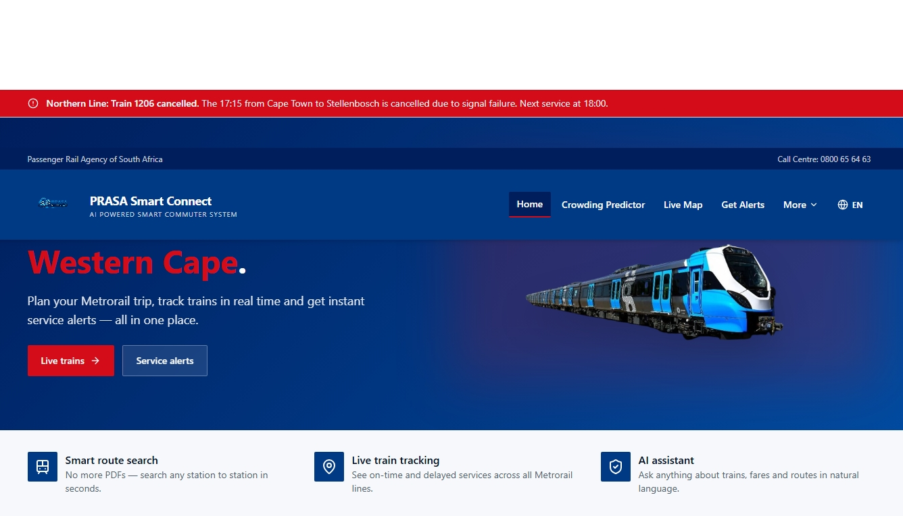

<div align="center">

# 🚆 PRASA Smart Connect

### AI-Powered Smart Commuter Platform for South African Rail Transport



**Modernising railway transportation through Artificial Intelligence, Real-Time Tracking, Digital Ticketing and Automation.**


</div>

---

# 📖 Overview

PRASA Smart Connect is an intelligent railway passenger management platform designed to improve the commuting experience for South African passengers.

The system provides passengers with real-time train information, digital ticketing, automated notifications, live service alerts, AI-powered assistance, crowding predictions, and enhanced safety features through one modern web platform.

The project was developed as part of a real-world digital transformation initiative, demonstrating how modern technologies can improve railway operations and passenger communication.

---

# 🖼️ System Preview


---

# 🎯 Objectives

The project aims to:

- Improve passenger communication
- Reduce uncertainty caused by train delays
- Digitise ticket management
- Improve passenger safety
- Provide real-time railway information
- Automate operational processes
- Support PRASA's digital transformation

---

# ✨ Key Features

## 🚆 Live Train Updates

- Live train status
- Delay notifications
- Cancellation alerts
- Service notices
- Platform information

---

## 🎫 Digital Ticketing

- QR Code tickets
- Ticket validation
- Ride tracking
- Ticket expiry management
- Multi-ride ticket support

---

## 🛡️ Security Portal

Security personnel can:

- Scan QR tickets
- Verify ticket authenticity
- View remaining rides
- Check expiry dates
- Detect invalid or expired tickets
- Validate passenger journeys

---

## 🤖 AI Assistant

Passengers can ask questions about:

- Train schedules
- Routes
- Stations
- Ticket information
- Service updates
- Lost property
- Safety information

---

## 📊 Crowding Predictor

The platform analyses passenger feedback to estimate:

- Train occupancy
- Crowding levels
- Safety score
- Passenger sentiment

---

## 📍 Route Search

Passengers can search:

- Departure station
- Destination
- Available routes
- Estimated arrival times
- Journey duration

---

## 🗺️ Live Train Tracking

Displays:

- Active trains
- Current train position
- Station progress
- Service status

---

## 🔔 Notifications

Passengers automatically receive:

- Email notifications
- SMS notifications
- Delay alerts
- Cancellation alerts
- Service notices
- Lost & Found notifications

---

## 👜 Lost & Found

Passengers can:

- Report lost items
- Track reports
- Receive automatic notifications
- View recovered items

---

## 📈 Admin Dashboard

Administrators can manage:

- Train schedules
- Users
- Tickets
- Passenger reports
- Lost property
- Analytics
- Notifications
- Daily reports

---

# ⚙️ Automation

The platform automates several important railway operations.

### Every 10 Minutes

- Scrapes live train updates
- Updates train status
- Updates service notices

### Automatically

- Sends delay notifications
- Sends cancellation alerts
- Updates crowding predictions
- Generates daily reports
- Monitors ticket expiry
- Logs every automated event
- Refreshes live train data

This significantly reduces manual work while improving passenger communication.

---

# 🏗️ System Architecture

```
Passengers
      │
      ▼
PRASA Smart Connect
      │
      ├──────────────► AI Chatbot
      │
      ├──────────────► Ticket System
      │
      ├──────────────► Security Portal
      │
      ├──────────────► Crowding Predictor
      │
      ├──────────────► Route Search
      │
      ├──────────────► Live Tracking
      │
      ├──────────────► Lost & Found
      │
      ▼
Automation Engine
      │
      ▼
Supabase Database
      │
      ▼
EmailJS + SMSPortal
```

---

# 💻 Technology Stack

### Frontend

- React
- TypeScript
- Tailwind CSS
- TanStack Router
- ShadCN UI
- Lucide Icons

### Backend

- Express.js
- Node.js
- TypeScript

### Database

- Supabase
- PostgreSQL
- Realtime Database

### APIs & Services

- OpenAI
- SMSPortal
- EmailJS
- Supabase Edge Functions

### Automation

- Node Cron
- Database Triggers
- Database Webhooks
- Edge Functions
- Realtime Events

---

# 🔒 Security

The platform includes:

- Role-based authentication
- Admin portal
- Super Admin portal
- Security officer portal
- QR code ticket validation
- Audit logs
- Secure database policies
- Real-time monitoring

---

# 📊 Business Benefits

## Passengers

- Faster access to train information
- Real-time updates
- Improved safety
- Digital ticketing
- Better travel planning

## PRASA

- Reduced operational workload
- Improved communication
- Automated reporting
- Better passenger satisfaction
- Digital transformation

---

# 🚀 Future Improvements

- GPS-based train tracking
- Mobile application
- WhatsApp integration
- Predictive delay analysis
- Offline QR validation
- Smart fare calculation
- Passenger reward programme

---

# 👨‍💻 Developers

**Ntando Badla** **Semoshwe Mapokgole** and **Sibahle Lottering**

Software Developers

### Technologies

- React
- TypeScript
- Java
- Laravel
- MySQL
- PostgreSQL
- Supabase
- Tailwind CSS
- Express.js

---

# 📄 License

This project was developed for educational and portfolio purposes to demonstrate modern software engineering practices and digital innovation within South African public transportation.

---

<div align="center">

### ⭐ If you like this project, consider giving it a Star!

**PRASA Smart Connect — Making Railway Travel Smarter, Safer, and More Connected.**

</div>
